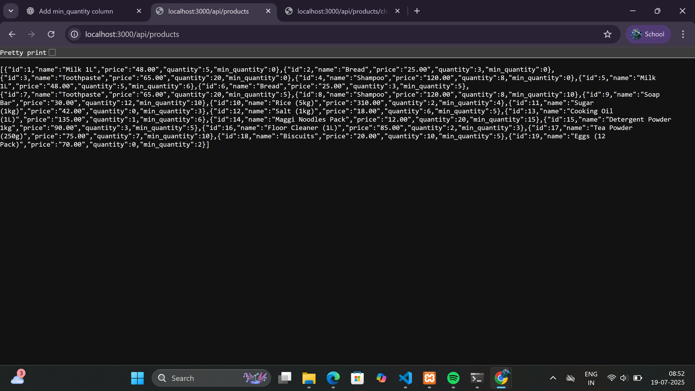
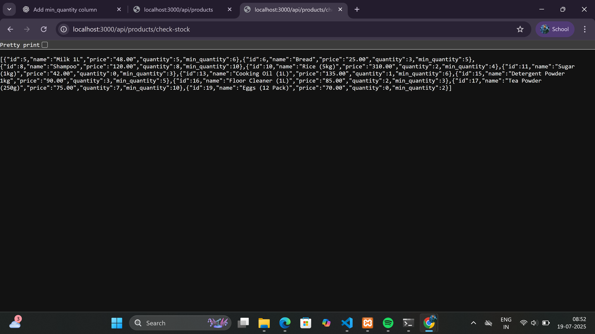
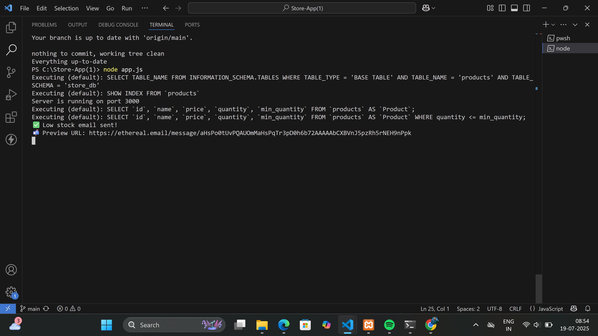

📦 StockGuard – Smart Alerts for Low Inventory
A Node.js + MySQL based inventory management backend that automatically detects low-stock products and sends email alerts to store managers. Ideal for retail and small business inventory tracking.

🚀 Project Features
✅ Add & manage products with price, quantity, and minimum stock level

📉 Detects low-stock items automatically

📬 Sends alert emails for low-stock products (via Ethereal / Gmail)

🧩 Built using Express, Sequelize, MySQL, and Nodemailer

🔌 REST API for integration with frontend or mobile apps

🛠️ Tech Stack
Layer	Technology
Backend	Node.js, Express
Database	MySQL, Sequelize ORM
Email	Nodemailer (Ethereal for testing)
Scheduling	node-cron (optional)
Versioning	Git + GitHub

📁 Folder Structure
bash
Copy code
Store-App/
├── models/             # Sequelize product model
├── routes/             # API routes (product + stock check)
├── utils/
│   ├── mailer.js       # Sends email alerts
│   └── stockChecker.js # Reusable stock-check logic
├── app.js              # Main Express app entry
├── package.json
└── README.md           # You're reading this!
⚙️ Setup Instructions
📌 1. Clone the repo
bash
Copy code
git clone https://github.com/Suriya123-MVS/StockGuard-Smart-Alerts-for-Low-Inventory.git
cd StockGuard-Smart-Alerts-for-Low-Inventory
📦 2. Install dependencies
bash
Copy code
npm install
🛠️ 3. Setup MySQL database
Create a database (e.g. store_db)

Make sure the products table exists with this SQL:

sql
Copy code
CREATE TABLE products (
  id INT AUTO_INCREMENT PRIMARY KEY,
  name VARCHAR(100),
  price DECIMAL(10,2),
  quantity INT,
  min_quantity INT DEFAULT 0 NOT NULL
);
✅ You can also insert test products with low stock to test alerts.

🧠 4. Configure database and email (Optional .env)
Update your DB and email config directly in the code (or use a .env file for production).

🚀 Running the App
bash
Copy code
node app.js
Now visit:

http://localhost:3000/api/products → View all products

http://localhost:3000/api/products/check-stock → Trigger low stock check + send email alert

You’ll see something like this in the terminal:

arduino
Copy code
✅ Low stock email sent!
📬 Preview URL: https://ethereal.email/message/xxxxx
Click that URL to preview the email in your browser (if using Ethereal).

📬 Email Alert Example
Subject: ⚠️ Low Stock Alert
Body:

less
Copy code
The following products are low in stock:

• Milk 1L (Qty: 2, Min: 5)
• Sugar (Qty: 0, Min: 3)
🕒 (Optional) Auto-Scheduling
Use node-cron to run stock checks automatically every day/hour.

js
Copy code
const cron = require('node-cron');
const checkLowStock = require('./utils/stockChecker');

cron.schedule('0 9 * * *', () => {
  checkLowStock(); // every day at 9AM
});
🧪 API Endpoints
Method	Route	Description
GET	/api/products	List all products
GET	/api/products/check-stock	Check & alert low stock

### 📸 Screenshots

#### 🔔 Low Stock Email Preview

#### 🧪 API Output (Low Stock)

#### ✅ Check Stock Trigger

#### 💻 Terminal Alert Output

👨‍💻 Author
V. Suriya
📫 GitHub: Suriya123-MVS
